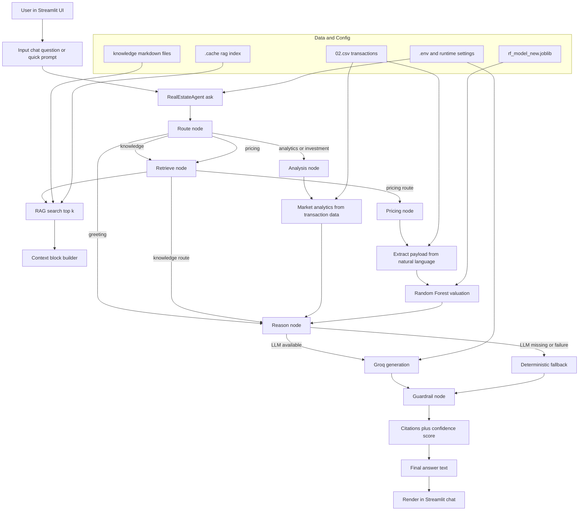

# System Architecture Diagram

```mermaid
flowchart TD
		U[User in Streamlit UI] --> I[Input chat question or quick prompt]
		I --> A[RealEstateAgent ask]

		A --> R0[Route node]
		R0 -->|greeting| RS[Reason node]
		R0 -->|knowledge| RT[Retrieve node]
		R0 -->|analytics or investment| AN[Analysis node]
		R0 -->|pricing| RT

		RT --> RG[RAG search top k]
		RG --> RC[Context block builder]
		RT -->|pricing route| PR[Pricing node]
		RT -->|knowledge route| RS

		AN --> MKT[Market analytics from transaction data]
		MKT --> RS

		PR --> PX[Extract payload from natural language]
		PX --> RF[Random Forest valuation]
		RF --> RS

		RS -->|LLM available| LLM[Groq generation]
		RS -->|LLM missing or failure| FB[Deterministic fallback]
		LLM --> G[Guardrail node]
		FB --> G

		G --> C[Citations plus confidence score]
		C --> O[Final answer text]
		O --> UI[Render in Streamlit chat]

		subgraph Data and Config
			D1[02.csv transactions]
			D2[rf_model_new.joblib]
			D3[knowledge markdown files]
			D4[.env and runtime settings]
			D5[.cache rag index]
		end

		D1 --> MKT
		D1 --> PX
		D2 --> RF
		D3 --> RG
		D4 --> A
		D4 --> LLM
		D5 --> RG
```
